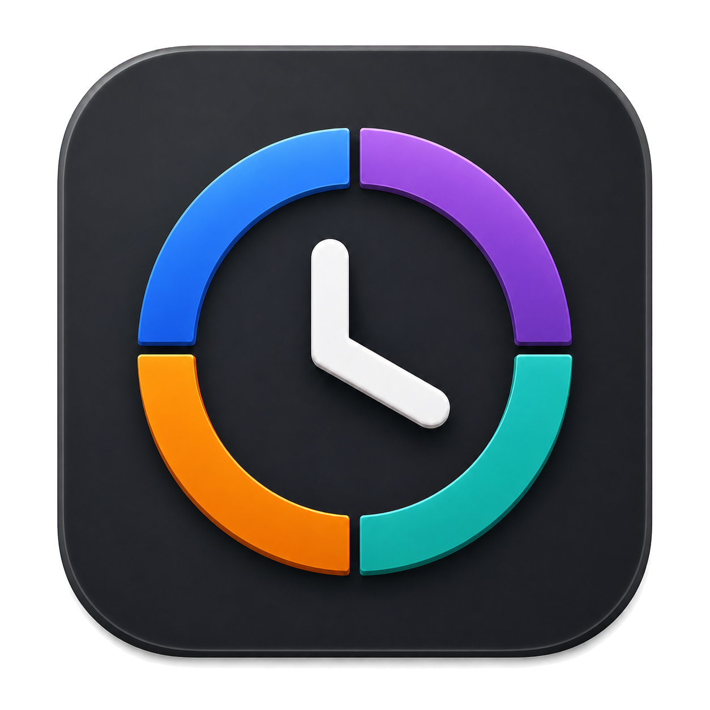

<p align="center">
  
</p>

# Weeklight

Weeklight is a local-first macOS menu-bar app for planning a project week and
tracking the time spent against it. It stays out of the way while you work:
start or switch a timer from the menu bar, then open the dashboard when you
want a wider view.

The project is written in Swift and SwiftUI, uses Core Data for persistence,
and has no third-party runtime dependencies.

## Downloads

Tagged builds are available on the
[GitHub Releases page](https://github.com/diliadis/weeklight/releases). Choose
`arm64` for Apple-silicon Macs or `x86_64` for Intel Macs. Each release also
contains a SHA-256 checksum, and its ZIP archives have GitHub build-provenance
attestations.

These community builds are ad-hoc signed and are not Apple-notarized. On first
launch, move Weeklight to Applications, Control-click it, choose **Open**, and
confirm the prompt. macOS may instead require approval under **System Settings
→ Privacy & Security**. This extra step is expected until the project uses an
Apple Developer ID and notarization.

## Features

- Project creation, color coding, editing, and non-destructive archiving
- Default weekly allocations with independently editable weekly snapshots
- Stopwatch and countdown timers with pause, resume, stop, and project switching
- Native countdown and weekly-allocation notifications
- Live project progress and remaining-time calculations
- Manual time entry, correction, reassignment, splitting, and confirmed deletion
- Logical focus sessions that group pause/resume timer segments
- Markdown notes with Write/Preview modes and safe web links
- Local recognition of GitHub commit, pull request, and issue links
- Reusable tags plus Activity search and tag filtering
- Timer recovery after relaunch, including paused countdown state
- Correct accounting for sessions that cross a weekly boundary
- macOS-managed launch at login with approval-state feedback
- Native light mode, dark mode, keyboard, and VoiceOver behavior

## Architecture

The application uses a feature-oriented structure:

```text
Sources/Weeklight/
├── App/             Application state, coordination, and lifecycle
├── Domain/          Pure date, allocation, metadata, and duration rules
├── Models/          Core Data managed objects
├── Persistence/     Versioned programmatic Core Data model and migrations
├── Notifications/   Native timer-notification scheduling
├── System/          macOS service integrations
├── Design/          Palette and localized formatting
└── Views/           Dashboard, projects, activity, settings, and menu bar
```

`AppModel` is the main-actor mutation boundary. Views do not write to Core Data
directly. Persisted timestamps remain the source of truth; the displayed clock
simply refreshes the derived timer state once per second.

## Requirements

- macOS 14 or newer to run Weeklight
- Xcode 26 or another Swift 6.2-compatible Apple toolchain to build and test
- Apple Silicon or Intel Mac

## Build and run

After cloning the repository:

```bash
swift test
./Scripts/verify.sh
./Scripts/build-app.sh
open dist/Weeklight.app
```

You can also open `Package.swift` in Xcode and run the `Weeklight` scheme.

The packaging script detects the active macOS SDK and host architecture. It
creates an ad-hoc signed, sandboxed application at `dist/Weeklight.app`.

## Verification

The repository has two complementary test paths:

- `swift test` runs the Swift Testing unit and application-model suites.
- `./Scripts/verify.sh` compiles and runs a standalone regression harness,
  including persistence migration checks against isolated Core Data stores.

Pull requests run both paths and create a production app bundle in GitHub
Actions.

## Persistence and privacy

Weeklight does not require an account and does not make background network
requests. Its SQLite store lives in the app's Application Support container.
Running timers are saved immediately and recovered from their timestamps after
relaunch.

Links in notes open only when clicked. GitHub references are recognized locally;
the app does not request repository metadata, tokens, or credentials.

The current schema automatically migrates earlier Weeklight stores and preserves
legacy session notes.

## Distribution

Every successful push to `main` produces a downloadable Apple-silicon
development artifact retained by GitHub Actions for 14 days. A version tag such
as `v1.1.0` runs the full test suite and publishes permanent Apple-silicon and
Intel ZIPs, checksum files, generated release notes, and build attestations.
Prerelease tags such as `v1.2.0-beta.1` create GitHub prereleases.

To verify a downloaded archive from its containing directory:

```bash
shasum -a 256 -c Weeklight-v1.1.0-macos-arm64.zip.sha256
gh attestation verify Weeklight-v1.1.0-macos-arm64.zip \
  --repo diliadis/weeklight
```

Maintainer instructions are in [RELEASING.md](RELEASING.md). The source icon
and generated Retina resource live in `Support/AppIcon/`. Developer ID signing
and notarization can be added to the same workflow later without changing the
release format.

## Contributing and security

See [CONTRIBUTING.md](CONTRIBUTING.md) for the development workflow and
[SECURITY.md](SECURITY.md) for responsible vulnerability reporting. Project
changes are recorded in [CHANGELOG.md](CHANGELOG.md), and participation is
governed by the [Code of Conduct](CODE_OF_CONDUCT.md).

## License

No open-source license has been selected yet. Until a license is added, the
source is publicly viewable but normal copyright restrictions still apply.
